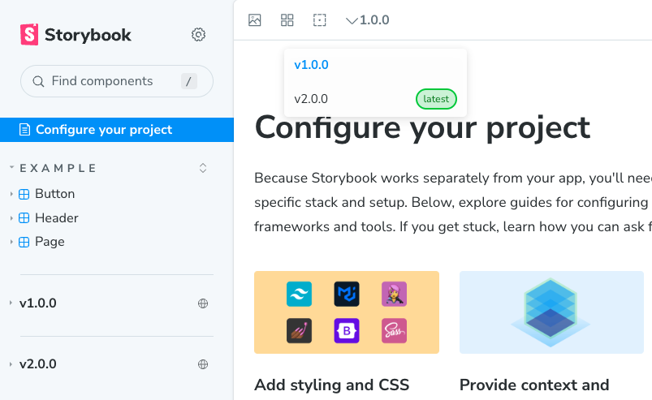

# Storybook Semantic Version Deploy [](https://npmjs.com/package/storybook-addon-semantic-version) [](https://npmjs.com/package/storybook-addon-semantic-version)

Storybook addon to deploy semantically versioned(Semver) components.Note that this plugin currently doesn't support hot reloading and you'll need to build a static storybooks to properly view the versioned components.



## Getting started

### 1. Install the package in your NX monorepo root

```shell
npm install storybook-addon-semantic-version
```

OR

```shell
pnpm add storybook-addon-semantic-version
```

### 2. Register the addon in your root Storybook instance

_Note: `.storybook/refs.generated.js` is automatically generated when running step 3. If it throws error create one manually_

```typescript
import { refs } from './refs.generated';

export default {
  refs,
  addons: ['@storybook/addon-essentials', 'storybook-addon-semantic-version'],
};
```

### 3. Generate refs + build Storybooks

Will find all storybook instances within your NX monorepo and then generate static storybook build folder and put in `dist/storybooks/<lib>/<version>`. The version is based on package.json of the `<lib>`. Make sure to run it from the root folder of your project.

```shell
npx storybook-addon-semantic-version
```

After building everything this is how your dist folder should look like:

```
dist/
├── root/
│   ├── storybook/         ← static root Storybook build
│   └── versions.json      ← preserved
├── storybooks/
│   └── v1.2.4/            ← library name
```

### 5. Serve it

To test locally you can just run

```shell
npx serve dist --cors
```

You should now be able to view your main storybook at `http://localhost:3000/root/storybook`

_Note: You can deploy your entire dist folder to a storage bucket online and make it available through a DNS_

_WARN: If you don't store the dist folder somewhere and you accidentally delete it, you'll loose all your previously built versions. And you'll have only the latest versions. You'll then need to clear the refs.generated.ts and versions.json from your .storybook folder becasue those will become invalid at this point._

## Contributing:

Take a look at issues tab for contribution.

## License

storybook-addon-semantic-version is MIT licensed
